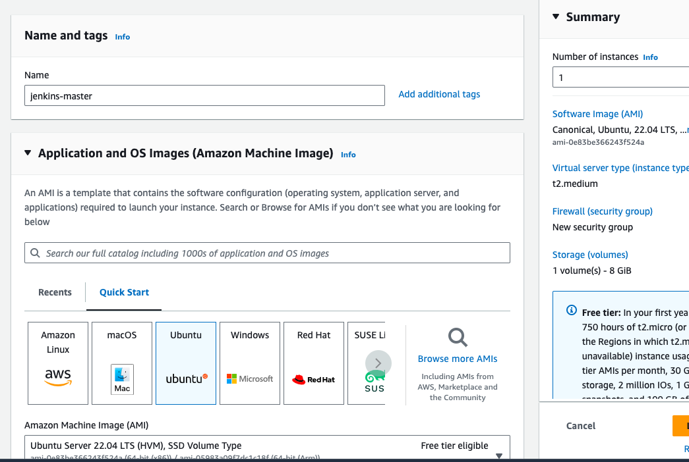

# Jenkins CICD Pipeline

We are going to implement the CICD pipleine using Jenkins, Maven


# Jenkins Installation

### Step 1: Launch an AWS EC2 Ubuntu Instance


### Step 2: SSH into Your EC2 Instance

1. **Find the Public IP**: Go to the EC2 dashboard, find your new instance, and copy its public IP address.

2. **SSH into the Instance**:
   - Open a terminal.
   - Navigate to the directory containing the downloaded key pair.
   - Run: `ssh -i "YourKeyPair.pem" ubuntu@YourInstancePublicIP`.
   - If prompted, accept the connection by typing `yes`.

### Step 3: Install Jenkins on EC2 Instance

1. **Update the System**:
   ```bash
   sudo apt update
   ```

2. **Install Java**:
   ```bash
   sudo apt install openjdk-11-jre
   ```

3. **Verify Java Installation**:
   ```bash
   java -version
   ```

4. **Add Jenkins Repository and Key**:
   ```bash
   curl -fsSL https://pkg.jenkins.io/debian/jenkins.io-2023.key | sudo tee \
     /usr/share/keyrings/jenkins-keyring.asc > /dev/null
   echo deb [signed-by=/usr/share/keyrings/jenkins-keyring.asc] \
     https://pkg.jenkins.io/debian binary/ | sudo tee \
     /etc/apt/sources.list.d/jenkins.list > /dev/null
   ```

5. **Install Jenkins**:
   ```bash
   sudo apt-get update
   sudo apt-get install jenkins
   ```

6. **Start Jenkins**:
   ```bash
   sudo systemctl start jenkins
   ```

7. **Enable Jenkins to Start at Boot**:
   ```bash
   sudo systemctl enable jenkins
   ```

### Step 4: Accessing Jenkins

1. **Access Jenkins**:
   - Open a web browser.
   - Go to `http://YourInstancePublicIP:8080`.

2. **Unlock Jenkins**:
   - Retrieve the Administrator password:
     ```bash
     sudo cat /var/lib/jenkins/secrets/initialAdminPassword
     ```
   - Copy and paste this password into the Jenkins console to unlock it.

3. **Complete the Setup**: Follow the on-screen instructions to complete the Jenkins setup.

### Note on Security

- It's recommended to restrict access to Jenkins and SSH only to known IPs for security.
- Regularly update and patch your EC2 instance and Jenkins installation.
- Consider setting up HTTPS for Jenkins for secure access.

This setup will get your Jenkins instance running on an AWS EC2 Ubuntu server. You can then proceed with configuring Jenkins for your CI/CD pipeline, including Docker, Kubernetes, and other tools as needed.
## Installation

Install my-project with npm

```bash
  npm install my-project
  cd my-project
```
    