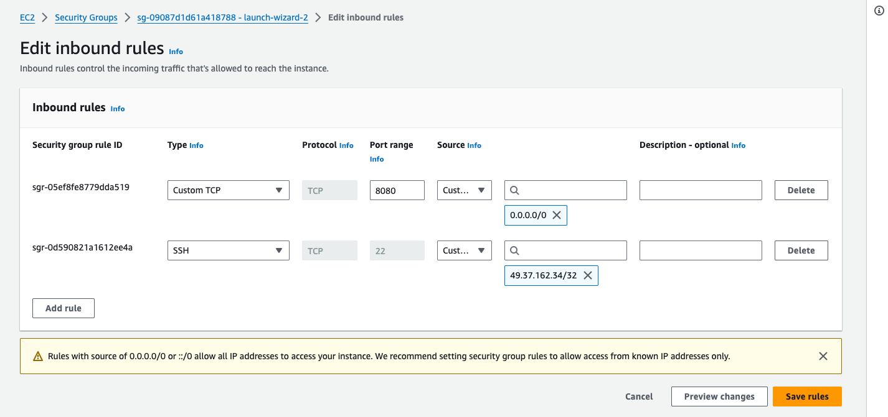
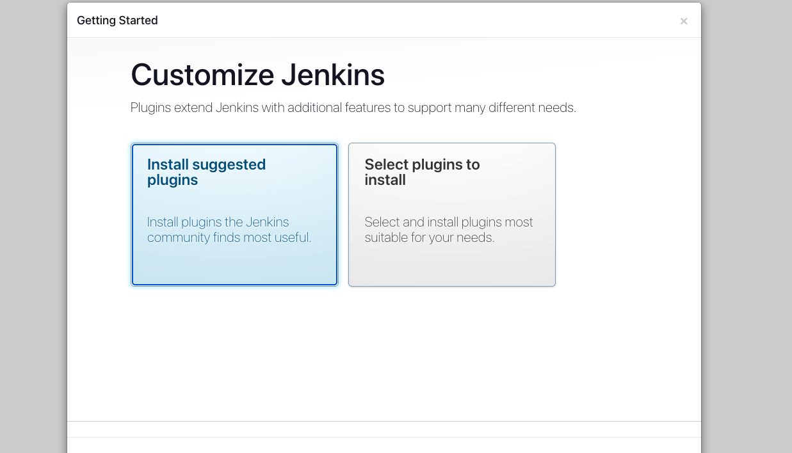
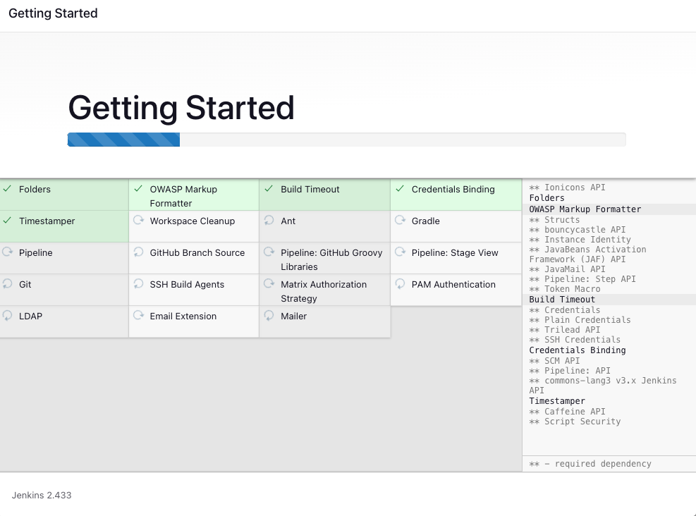
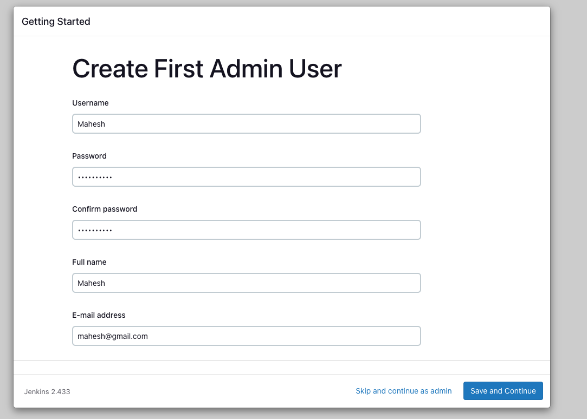
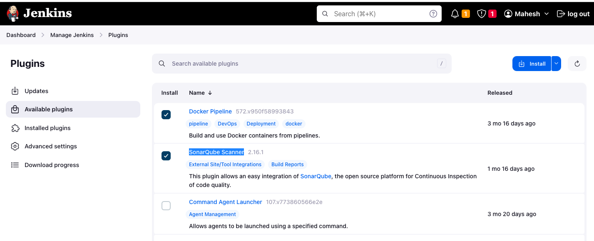

# Jenkins CICD Pipeline

We are going to implement the CICD pipleine using Jenkins, Maven


# Jenkins Installation

### Step 1: Launch an AWS EC2 Ubuntu Instance

### Configure Security Group:

- Create a new security group or select an existing one.
- Ensure to add a rule to allow SSH (port 22) for your IP address for secure access.
- Add a custom TCP rule to allow port 8080 for Jenkins.

### Step 2: SSH into Your EC2 Instance

1. **Find the Public IP**: Go to the EC2 dashboard, find your new instance, and copy its public IP address.

2. **SSH into the Instance**:
   - Open a terminal.
   - Navigate to the directory containing the downloaded key pair.
   - Run: `ssh -i "YourKeyPair.pem" ubuntu@YourInstancePublicIP`.
   - If prompted, accept the connection by typing `yes`.

### Step 3: Install Jenkins on EC2 Instance

1. **Update the System**:
   ```bash
   sudo apt update
   ```

2. **Install Java**:
   ```bash
   sudo apt install openjdk-11-jre -y
   ```

3. **Verify Java Installation**:
   ```bash
   java -version
   ```

4. **Add Jenkins Repository and Key**:
   ```bash
   curl -fsSL https://pkg.jenkins.io/debian/jenkins.io-2023.key | sudo tee \
     /usr/share/keyrings/jenkins-keyring.asc > /dev/null
   echo deb [signed-by=/usr/share/keyrings/jenkins-keyring.asc] \
     https://pkg.jenkins.io/debian binary/ | sudo tee \
     /etc/apt/sources.list.d/jenkins.list > /dev/null
   ```

5. **Install Jenkins**:
   ```bash
   sudo apt-get update
   sudo apt-get install jenkins
   ```

6. **Start Jenkins**:
   ```bash
   sudo systemctl start jenkins
   ```

7. **Enable Jenkins to Start at Boot**:
   ```bash
   sudo systemctl enable jenkins
   ```

### Step 4: Accessing Jenkins

1. **Access Jenkins**:
   - Open a web browser.
   - Go to `http://YourInstancePublicIP:8080`.

2. **Unlock Jenkins**:

   - Retrieve the Administrator password:
     ```bash
     sudo cat /var/lib/jenkins/secrets/initialAdminPassword
     ```
   - Copy and paste this password into the Jenkins console to unlock it.

3. **Complete the Setup**: Follow the on-screen instructions to complete the Jenkins setup.
- Click on the Installed suggested plugins


- Create Admin user as show below 


### Step 5: Installing required plugins
 - Go to Manage Jenkins > Manage Plugins.
 - In the Available tab, search for "Docker Pipeline", "SonarQube Scanner" and click on install
 